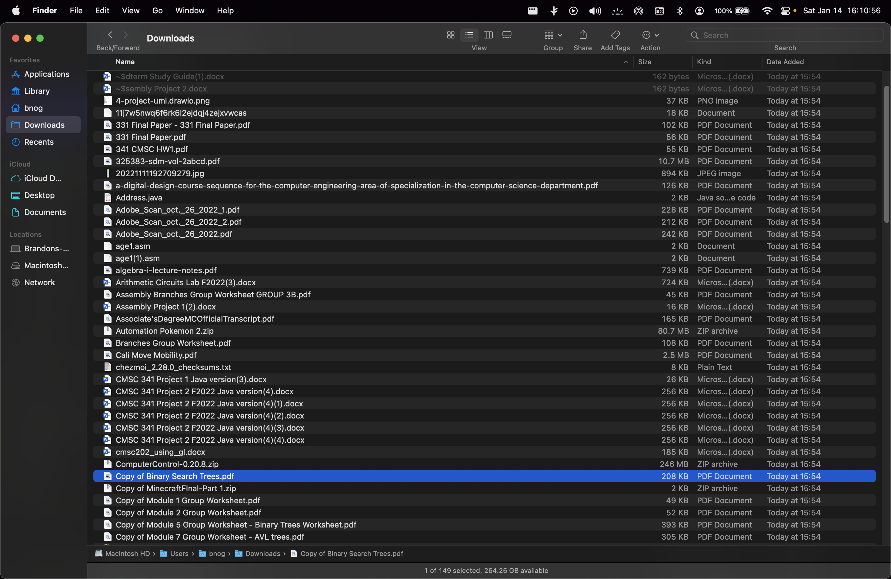
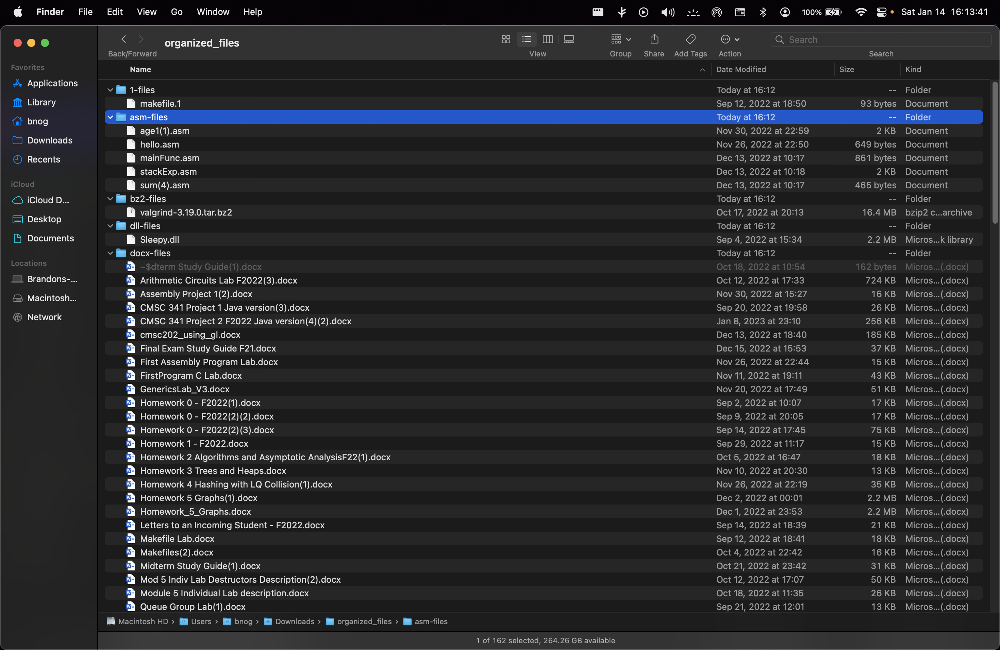

# Al

`Al` is a command line tool written in `Python`. It efficiently organizes whatever directory you'd like, skipping over pre-existing directories and hidden files and/or folders. 
`Al` creates a new folder called `organized files` and creates a folder for ever type of file extension found within the path that you tell it to (See [Pictures](##Pictures))

## Installation
***NOT ABLE TO BE INSTALLED YET UNLESS YOU CLONE THE REPO***
More information on how to install this program will be added later.

## Usage
```
Usage: al [options] path

Al is a program that organizes a given directory by creating directories based on the file extensions found within the given path

Options:
  -h, --help     show this help message and exit
  -v, --verbose  show tree of the resulting organized folder
```

### Example usage and output

```
al ~/Downloads -v
```

```
/Users/bnog/Downloads
└── organized-files
    ├── 1-files
    │   └── makefile.1
    │
    ├── asm-files
    │   ├── age1(1).asm
    │   ├── hello.asm
    │   ├── mainFunc.asm
    │   ├── stackExp.asm
    │   └── sum(4).asm
    │
    ├── bz2-files
    │   └── valgrind-3.19.0.tar.bz2
    │
    ├── dll-files
    │   └── Sleepy.dll
    │
    ├── docx-files
    │   ├── Arithmetic Circuits Lab F2022(3).docx
    │   ├── Assembly Project 1(2).docx
    │   ├── CMSC 341 Project 1 Java version(3).docx
    │   ├── CMSC 341 Project 2 F2022 Java version(4)(2).docx
    │   ├── Final Exam Study Guide F21.docx
    │   ├── First Assembly Program Lab.docx
    │   ├── FirstProgram C Lab.docx
    │   ├── GenericsLab_V3.docx
    │   ├── Homework 0 - F2022(1).docx
    │   ├── Homework 0 - F2022(2)(2).docx
    │   ├── Homework 0 - F2022(2)(3).docx
    │   ├── Homework 1 - F2022.docx
    │   ├── Homework 2 Algorithms and Asymptotic AnalysisF22(1).docx
    │   ├── Homework 3 Trees and Heaps.docx
    │   ├── Homework 4 Hashing with LQ Collision(1).docx
    │   ├── Homework 5 Graphs(1).docx
    │   ├── Homework_5_Graphs.docx
    │   ├── Letters to an Incoming Student - F2022.docx
    │   ├── Makefile Lab.docx
    │   ├── Makefiles(2).docx
    │   ├── Midterm Study Guide(1).docx
    │   ├── Mod 5 Indiv Lab Destructors Description(2).docx
    │   ├── Module 5 Individual Lab description.docx
    │   ├── Queue Group Lab(1).docx
    │   ├── Schedule CMSC313 F2022(1).docx
    │   ├── Schedule CMSC340 F2022(2).docx
    │   ├── Schedule CMSC341 F2022 original(1).docx
    │   ├── Sofware to access gl(2).docx
    │   ├── Summary of topics FinalA(2).docx
    │   ├── Summary of topics Midterm.docx
    │   ├── Summary of topics midterm (Digital Logic First).docx
    │   ├── Things you might need to change in the GPP testbank(1).docx
    │   ├── UML_Project_2_Online_Shopping_Cart.docx
    │   ├── Using rextester(2).docx
    │   ├── Valgrind Lab.docx
    │   ├── cmsc202_using_gl.docx
    │   ├── software tools lab(1)(1).docx
    │   └── ~$dterm Study Guide(1).docx
    │
    ├── drawio-files
    │   └── Untitled Diagram.drawio
    │
    ├── duplicate-files
    │   ├── CMSC 341 Project 2 F2022 Java version(4)(1).docx
    │   ├── CMSC 341 Project 2 F2022 Java version(4)(3).docx
    │   ├── CMSC 341 Project 2 F2022 Java version(4)(4).docx
    │   ├── CMSC 341 Project 2 F2022 Java version(4).docx
    │   ├── Cali Move Mobility.pdf
    │   ├── Final Exam Study Guide F21(1).docx
    │   ├── Group #2 Quine McCluskey Group Worksheet-1.pdf
    │   ├── Homework 0 - F2022(2)(1).docx
    │   ├── Homework 0 - F2022(2).docx
    │   ├── Homework 5 Graphs.docx
    │   ├── Lecture 2 - addressing, syscall(1)(1).ppsx
    │   ├── Lecture 2 - addressing, syscall(1).ppsx
    │   ├── Lecture 6 - multifiles, makefiles.ppsx
    │   ├── Midterm Study Guide(1)(1).docx
    │   ├── Midterm Study Guide(1)(2).docx
    │   ├── Schedule CMSC340 F2022(2)(1).docx
    │   ├── Schedule CMSC341 F2022 original(1)(1).docx
    │   ├── Schedule CMSC341 F2022 original(1)(2).docx
    │   ├── Sofware to access gl(1).docx
    │   ├── Sofware to access gl.docx
    │   ├── Things you might need to change in the GPP testbank(1)(1).docx
    │   ├── X86 architecture, assembly, nasm(1)(1).ppsx
    │   ├── X86 architecture, assembly, nasm(1).ppsx
    │   ├── age1.asm
    │   ├── software tools lab(1).docx
    │   └── ~$sembly Project 2.docx
    │
    ├── iso-files
    │   ├── Win10_21H2_English_x32.iso
    │   └── Win10_21H2_English_x64.iso
    │
    ├── jar-files
    │   └── JFLAP7.1.jar
    │
    ├── java-files
    │   └── Address.java
    │
    ├── jpg-files
    │   ├── 20221111192709279.jpg
    │   ├── IMG_1809_Original.jpg
    │   ├── IMG_1926.jpg
    │   └── newpfp.jpg
    │
    ├── mp4-files
    │   └── QyEMgLa5KBAq55dg.mp4
    │
    ├── no-extension-files
    │   ├── 11j7w5nwq6f6rk6l2ejdqj4zejxvwcas
    │   ├── makefile
    │   └── makefile1
    │
    ├── pdf-files
    │   ├── 325383-sdm-vol-2abcd.pdf
    │   ├── 331 Final Paper - 331 Final Paper.pdf
    │   ├── 331 Final Paper.pdf
    │   ├── 341 CMSC HW1.pdf
    │   ├── Adobe_Scan_oct._26_2022.pdf
    │   ├── Adobe_Scan_oct._26_2022_1.pdf
    │   ├── Adobe_Scan_oct._26_2022_2.pdf
    │   ├── Assembly Branches Group Worksheet GROUP 3B.pdf
    │   ├── Branches Group Worksheet.pdf
    │   ├── Copy of Binary Search Trees.pdf
    │   ├── Copy of Module 1 Group Worksheet.pdf
    │   ├── Copy of Module 2 Group Worksheet.pdf
    │   ├── Copy of Module 5 Group Worksheet - Binary Trees Worksheet.pdf
    │   ├── Copy of Module 7 Group Worksheet - AVL trees.pdf
    │   ├── Episode-4.07-Transcript.pdf
    │   ├── Group #2 Quine McCluskey Group Worksheet.pdf
    │   ├── Homework 2.pdf
    │   ├── Letter to an incoming student.pdf
    │   ├── Linear Algebra and Its Applications 5th Edition.pdf
    │   ├── On the importance of learning circuits and digital design as a computer science student.pdf
    │   ├── Parsing Lab Week 7.pdf
    │   ├── This I Believe Essay.pdf
    │   ├── Valgrind Lab.pdf
    │   ├── a-digital-design-course-sequence-for-the-computer-engineering-area-of-specialization-in-the-computer-science-department.pdf
    │   ├── algebra-i-lecture-notes.pdf
    │   ├── differential-geometry-lecture-notes.pdf
    │   ├── european_space_agency_standards.pdf
    │   └── pdfcoffee.com_cali-move-mobilitypdf-pdf-free.pdf
    │
    ├── png-files
    │   ├── 4-project-uml.drawio.png
    │   ├── oliver-atom.png
    │   └── q2_part1.png
    │
    ├── ppsx-files
    │   ├── Lecture 2 - addressing, syscall(1)(2).ppsx
    │   ├── Lecture 3 - Branches Loops Selection c functions(1).ppsx
    │   ├── Lecture 6 - multifiles, makefiles(1).ppsx
    │   └── X86 architecture, assembly, nasm(1)(2).ppsx
    │
    ├── pptx-files
    │   ├── Lecture 12 - DecoderLab.pptx
    │   ├── Lecture 12 - MuxLabA.pptx
    │   └── Trees - when to use.pptx
    │
    ├── txt-files
    │   ├── chezmoi_2.28.0_checksums.txt
    │   ├── message.txt
    │   └── mytest.txt
    │
    ├── uml-files
    │   └── UMLTool.uml
    │
    └── zip-files
        ├── Automation Pokemon 2.zip
        ├── ComputerControl-0.20.8.zip
        ├── Copy of MinecraftFInal-Part 1.zip
        ├── Decoder_Lab.zip
        ├── Exam2StudentCode.zip
        ├── LicenseSupportInstallerMac.zip
        ├── MPK mini Software Manager-1.1.1-2.zip
        ├── Programming Project 3 Booklist (F21).zip
        ├── Programming Project 3 Booklist (F22)(1).zip
        ├── Programming Project 3 Booklist (F22).zip
        ├── logioptionsplus_installer.zip
        └── vim-snippets-master.zip
```

## Pictures

### Before



### After



## Useful information

`Al` ***DOES NOT*** remove files! I've left the choice for removal up to the user. 

The process of finding duplicate files will ***ALWAYS*** require obtaining the file's size, then reading and hashing the first 1024 bytes of every potentially duplicate file, and finally reading and hashing every remaining potentially duplicate file. The program ***DOES NOT** alter nor collect file information; you're free to read over the source code at any time. 

The necessary permissions must be granted to `Al` so it can fulfill its job. More information on this will be released later.

## Current TODOs

1. Package the program
2. Testing
